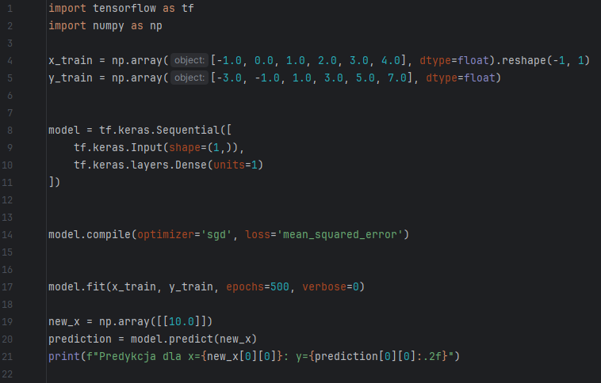
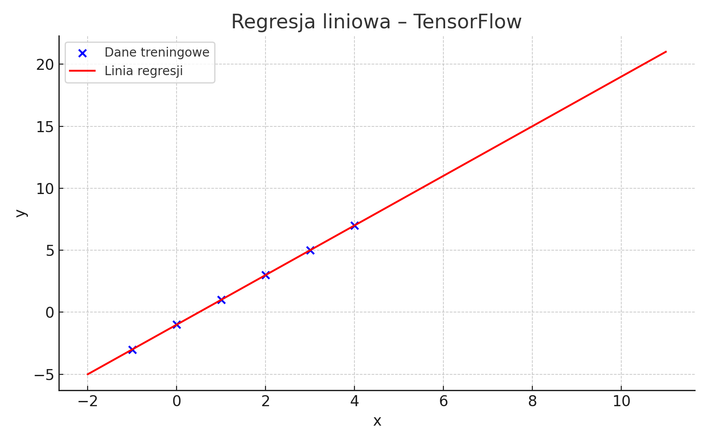

<h1 align="center"> Prosty Model Regresji Liniowej w TensorFlow</h1>

Ten projekt to edukacyjna implementacja **modelu regresji liniowej** z wykorzystaniem TensorFlow (Keras). Model uczy się zależności pomiędzy wartościami wejściowymi `x` a wyjściowymi `y`, a następnie dokonuje predykcji nowych wartości. Dane wejściowe i wyjściowe odzwierciedlają funkcję liniową:  
\[
y = 2x - 1
\]  
Model oparty jest na sieci neuronowej z jedną warstwą gęstą i uczy się przy użyciu optymalizatora **SGD** i funkcji straty **mean squared error**. Wykorzystywane są biblioteki `TensorFlow`, `NumPy`.

---

##  Technologie i środowisko

- **Język:** [](https://www.python.org)
- **IDE:** [](https://www.jetbrains.com/pycharm/) 
- **Biblioteki:**
  - [](https://www.tensorflow.org/)  
    ➤ Budowa i trening modelu regresji liniowej
  - [](https://numpy.org/)  
    ➤ Tworzenie danych numerycznych i konwersja tablic wejściowych

---

<details>
  <summary> Funkcje programu (kliknij, aby rozwinąć)</summary>

### 1. `x_train`, `y_train`
Statyczne dane wejściowe i wyjściowe uczące model zależności:
- `x_train`: [-1.0, 0.0, 1.0, 2.0, 3.0, 4.0]
- `y_train`: [-3.0, -1.0, 1.0, 3.0, 5.0, 7.0]

---

### 2. `model = tf.keras.Sequential([...])`
Tworzy model sekwencyjny z jedną warstwą:
- `Dense(units=1)` — odpowiada funkcji liniowej:  
  \[
  y = wx + b
  \]

---

### 3. `model.compile(...)`
Kompilacja modelu:
- Optymalizator: `sgd` (Stochastic Gradient Descent)
- Funkcja straty: `mean_squared_error`

---

### 4. `model.fit(...)`
Trenowanie modelu przez 500 epok z użyciem danych:
- `x_train` i `y_train`
- `verbose=0` — brak wypisywania postępu w konsoli

---

### 5. `model.predict(...)`
Predykcja wartości `y` dla nowej wartości `x`, np.:
```python
new_x = np.array([[10.0]])
```
Zwracany wynik np.:
```
Predykcja dla x=10.0: y=18.98
```

---

### 6. `matplotlib` (opcjonalnie)
Tworzenie wykresu:
- Punkty treningowe `x_train`, `y_train`
- Linia regresji przewidywana przez model

</details>

---


<details>
  <summary> Kod aplikacji (kliknij, aby rozwinąć)</summary>

#### Poniżej znajduje się pełny zrzut ekranu przedstawiający kod źródłowy aplikacji:



Zawarty kod prezentuje wszystkie kluczowe elementy:
- importy bibliotek `tensorflow` i `numpy`
- przygotowanie danych wejściowych
- budowę modelu `Sequential`
- kompilację modelu
- trening z danymi
- predykcję nowej wartości `y`

Kod jest krótki, przejrzysty i stanowi świetny punkt wyjścia do dalszej nauki regresji liniowej w TensorFlow.


</details>

---

<details>
  <summary> Podgląd działania (kliknij, aby rozwinąć)</summary>

#### 📌 Przykład działania w terminalu:
```
Predykcja dla x=10.0: y=18.98
```

#### 📊 Wygenerowany wykres regresji:



</details>

